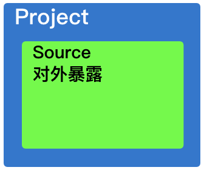
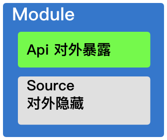
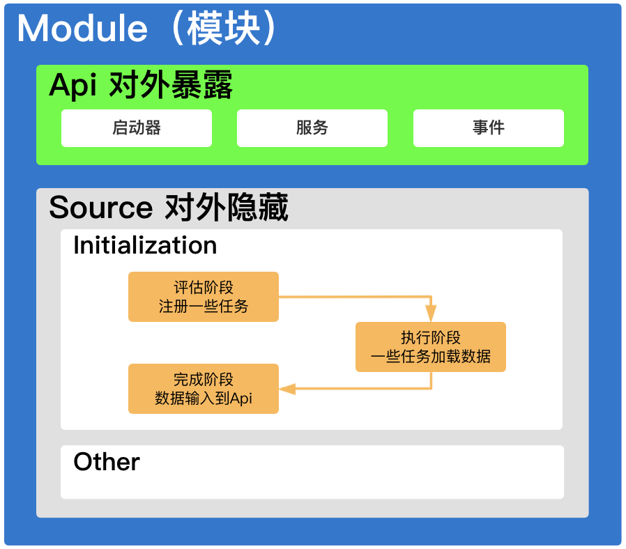
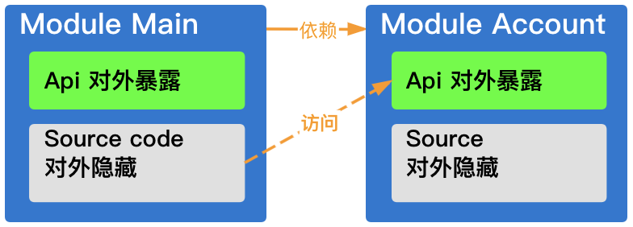
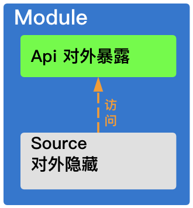
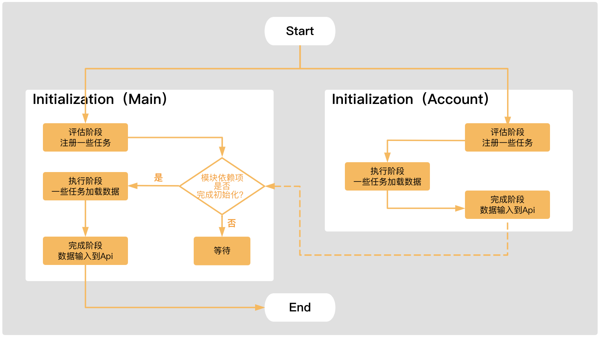
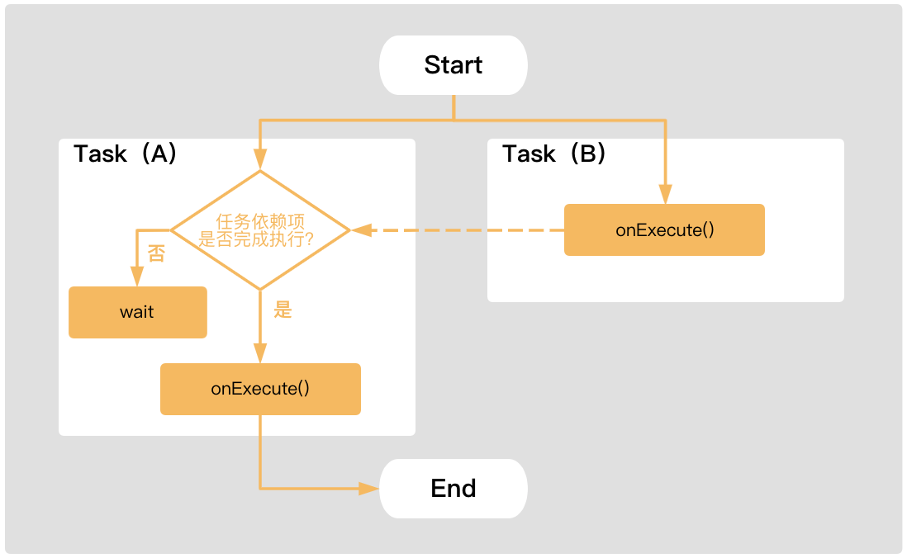

P2M
===
[](https://jitpack.io/#wangdaqi77/P2M) [](https://www.apache.org/licenses/LICENSE-2.0)

一个完整的Android组件化框架库。

以下环境经测试可正常运行：
<html>
<body>
<meta charset=utf-8>
<span style='font-variant-ligatures: normal;font-variant-caps: normal;
orphans: 2;widows: 2;-webkit-text-stroke-width: 0px;text-decoration-thickness: initial;
text-decoration-style: initial;text-decoration-color: initial'>

<table border=0 cellpadding=0 cellspacing=0 width=428 style='border-collapse:
 collapse;table-layout:fixed;width:321pt'>
 <col width=132 span=2 style='mso-width-source:userset;mso-width-alt:4224;
 width:99pt'>
 <col width=164 style='mso-width-source:userset;mso-width-alt:5248;width:123pt'>
 <tr height=43 style='mso-height-source:userset;height:32.0pt'>
  <td height=43 class=xl65 width=132 style='height:32.0pt;width:99pt'>APG版本</span></td>
  <td class=xl65 width=132 style='border-left:none;width:99pt'>
  <meta charset=utf-8>
  <span style='font-variant-ligatures: normal;font-variant-caps: normal;
  orphans: 2;widows: 2;-webkit-text-stroke-width: 0px;text-decoration-thickness: initial;
  text-decoration-style: initial;text-decoration-color: initial'>Gradle版本</span></td>
  <td class=xl65 width=164 style='border-left:none;width:123pt'>
  <meta charset=utf-8>
  <span style='font-variant-ligatures: normal;font-variant-caps: normal;
  orphans: 2;widows: 2;-webkit-text-stroke-width: 0px;text-decoration-thickness: initial;
  text-decoration-style: initial;text-decoration-color: initial'>Kotlin版本</span></td>
 </tr>
 <tr height=33 style='mso-height-source:userset;height:25.0pt'>
  <td height=33 class=xl66 style='height:25.0pt;border-top:none'>
  <meta charset=utf-8>
  <span style='font-variant-ligatures: normal;font-variant-caps: normal;
  orphans: 2;text-align:start;widows: 2;-webkit-text-stroke-width: 0px;
  text-decoration-thickness: initial;text-decoration-style: initial;text-decoration-color: initial'>3.4.0+</span></td>
  <td rowspan=2 class=xl66 style='border-top:none'>6.1.1+</td>
  <td rowspan=4 class=xl66 style='border-top:none'>1.3.20~1.4.20</td>
 </tr>
 <tr height=33 style='mso-height-source:userset;height:25.0pt'>
  <td height=33 class=xl66 style='height:25.0pt;border-top:none'>4.0.0+</td>
 </tr>
 <tr height=33 style='mso-height-source:userset;height:25.0pt'>
  <td height=33 class=xl66 style='height:25.0pt;border-top:none'>4.1.0+</td>
  <td class=xl66 style='border-top:none;border-left:none'>6.5+</td>
 </tr>
 <tr height=33 style='mso-height-source:userset;height:25.0pt'>
  <td height=33 class=xl66 style='height:25.0pt;border-top:none'>4.2.0+</td>
  <td class=xl66 style='border-top:none;border-left:none'>6.7.1+</td>
 </tr>
 <tr height=33 style='mso-height-source:userset;height:25.0pt'>
  <td height=33 class=xl66 style='height:25.0pt;border-top:none'>7.0.3</td>
  <td class=xl66 style='border-top:none;border-left:none'>7.0.2</td>
  <td rowspan=2 class=xl66 style='border-top:none'>1.5.10~1.6.0</td>
 </tr>
 <tr height=33 style='mso-height-source:userset;height:25.0pt'>
  <td height=33 class=xl66 style='height:25.0pt;border-top:none'>7.1.2</td>
  <td class=xl66 style='border-top:none;border-left:none'>7.2</td>
 </tr>
</table>
</body>
</html>

阅读本文档时结合[示例工程][example]效果更佳。

P2M是什么？
---------
P2M是完整的组件化工具，它的所有功能集成在[P2M插件][P2M插件]，使用插件可以将Project态升级为[Module态][Module态]：
 * 告别代码的下沉处理，模块内部代码完全内聚，提高了安全性
 * 支持增量编译
 * 支持[单独运行模块][单独运行模块]:
 * 支持[发布模块到仓库][如何发布模块到仓库]:
 * 支持[依赖仓库中的模块][如何依赖仓库中的模块]:

P2M插件
-------
P2M插件的全名为`p2m-android`，它需要在`settings.gradle`文件中进行声明。
 1. 在`settings.gradle`文件中声明：
    ```groovy
    buildscript {
        repositories {
            google()
            mavenCentral()
            maven { url 'https://jitpack.io' }
        }
    
        dependencies {
            classpath 'org.jetbrains.kotlin:kotlin-gradle-plugin:1.4.10'    // Kotlin支持1.3.20+
            classpath 'com.android.tools.build:gradle:4.0.2'                // AGP支持3.4.0+，gradle支持6.1.1+
            classpath 'com.github.wangdaqi77.P2M:p2m-plugin:$lastVersion'   // P2M插件
        }
    }
    
    // 声明插件
    apply plugin: "p2m-android"
    ```
    在[根目录下的build.gradle](./example/build.gradle)中声明依赖的插件在`settings.gradle`文件中也必须声明依赖，插件依赖参考示例中工程中[根目录下的settings.gradle](./example/settings.gradle)和[根目录下的build.gradle](./example/build.gradle)。

 2. 使用`p2m { }`配置组件化项目，在`settings.gradle`文件中：
    ```groovy
    // ...
    
    apply plugin: "p2m-android"
    
    p2m {
        app {                                                   // 声明一个app壳，至少声明一个，可声明多个
            include(":projectPath") {                           // 声明project描述
                projectDir = new File("your project path")      // 声明project文件夹路径，如project文件夹路径与settings.gradle同一层级可不用配置
            }
            dependencies {                                      // 声明模块依赖项，可依赖多个
                module("YourModuleName1")
                module("YourModuleName2")
            }
        }

        module("YourModuleName") {                              // 声明一个模块，驼峰命名，可声明多个
            include(":projectPath") {                           // 声明project描述
                projectDir = new File("your project path")      // 声明project文件夹路径，如project文件夹路径与settings.gradle同一层级可不用配置
            }
            dependencies {                                      // 声明模块依赖项，可依赖多个
                module("YourModuleName1")
                module("YourModuleName2")
            }

            groupId = "com.repo"                    // 组，默认值模块名。用于发布模块到仓库或者使用仓库中的模块
            artifactId = "module-yourmodulename"    // 发布件id，默认值module-${小写的YourModuleName}。用于发布模块到仓库或者使用仓库中的模块
            versionName = "0.0.1"                   // 版本，默认值unspecified。用于发布模块到仓库或者使用仓库中的模块
    
            useRemote = false                       // 使用远程仓库开关，默认false。true表示使用仓库，false表示使用源码
            runApp = false                          // 运行app开关，默认值false，true表示可以运行app，false表示作为模块，applicationId等配置在./projectPath/build.gradle中的p2mRunAppBuildGradle{}
        }

        p2mMavenRepository {                        // 声明maven仓库, 默认rootProjectPath/repo
            url = "your maven repository url"       // 仓库地址
            credentials {                           // 认证信息
                username = "your user name"
                password = "your password"
            }
        }
    }
    ```
    P2M插件将根据配置自动对app壳和模块引用插件`com.android.application`、`com.android.library`、`kotlin-android`和`kotlin-kapt`，因此在对应项目目录下的`build.gradle`文件中要移除这些插件声明，参考示例工程中[app壳的build.gradle](./example/app/build.gradle)和示例工程中[Main模块的build.gradle](./example/module-main/build.gradle)。

Module态
--------
通过[声明][声明模块]可以将Project态升级为Module态，一个Module态表示一个模块。

|Project态|Module态|
|---|---|
|include ':projectPath'|p2m {<br>    module('YourModuleName') {<br>        include(':projectPath')<br>    }<br>}|
|||

模块之间可以[建立依赖关系][声明模块的依赖项]，如果有A模块使用B模块，则A模块依赖B模块：
 * 对于A来说，B是**依赖项**；
 * 对于B来说，A是**外部模块**；
 * 此时B不能再依赖A了，**模块之间禁止互相依赖**。

一个模块包含一个[Api区][Api区]和一个[Source区][Source区]，Api区会暴露给外部模块，Source区是对外隐藏的。
<br/><br/><br/>

每个模块还支持：
 * [初始化][Initialization区]
 * [发布模块到仓库][如何发布模块到仓库]:
 * [依赖仓库中的模块][如何依赖仓库中的模块]:
 * [单独运行模块][单独运行模块]:

### 声明模块
假设有一个工程包含帐号功能和其他的功能，所有的功能都存放一个project中，它的project文件夹名称是`app`，工程的文件结构大致如下：
```
├── app
│   ├── src
│   └── build.gradle
├── build.gradle
└── settings.gradle
```
此时，`settings.gradle`文件中声明：
```groovy
include ":app"
```

接下来将帐号功能剥离出来作为单独的模块，并称其为帐号模块，它的project文件夹命名为`module-account`，此时工程的文件结构大致如下：
```
├── app                                     // app壳
│   ├── src
│   └── build.gradle
├── module-account                          // 帐号模块
│   ├── src
│   └── build.gradle
├── build.gradle
└── settings.gradle                         // P2M配置
```
帐号模块在P2M中命名为`Account`，在`settings.gradle`文件中声明：
```groovy
apply plugin: "p2m-android"
p2m {
    app {                                   // 声明app壳
        include(":app")
    }
    
    module("Account") {                     // 声明模块
        include(":module-account")          // 描述project
    }
}
```

如果`module-account`在更深的文件层级，工程的文件结构大致如下：
```
├── app
├── modules
│   └── module-account                      // 帐号模块
└── settings.gradle
```

此时P2M已经无法识别该模块的具体路径，这需要描述该模块的project文件夹路径，在`settings.gradle`文件中：
```groovy
p2m {
    // ...
    
    module("Account") {
        include(":module-account") {
            projectDir = new File("./modules/module-account") // 描述project文件夹路径
        }
    }
}
```

### 声明模块的依赖项
如果`Main`模块使用`Account`模块，因此`Main`需要依赖`Account`，在`settings.gradle`文件中声明：
```groovy
p2m {
    module("Account") {                         // 声明模块
        include(":module-account")              // 声明project
    }

    module("Main") {
        include(":module-main")
        dependencies {                          // 声明模块的依赖项，这里表示Main依赖Account
            module("Account")
        }
    }
}
```

此时`Account`的Api区暴露给了外部模块`Main`：
<br/><br/><br/>

模块也可以使用自身的Api区：
<br/><br/><br/>

app壳也支持声明依赖，在`settings.gradle`文件中：
```groovy
p2m {
    // ...
    
    app {                                       // 声明App壳
        include(":app")
        dependencies {                          // 声明模块的依赖项
            module("Main")
            module("Account")
        }
    }
}
```

### Api区
Api区是[模块][Module态]的一部分，它会暴露给外部模块，主要包含：
 * [启动器][启动器]，暴露`Activity`、`Fragment`、`Service`启动器，如`Account`模块对外暴露登录界面的启动器。
 * [服务][服务]，暴露方法，如`Account`模块对外暴露退出登录的方法。
 * [事件][事件]，暴露事件，如`Account`模块对外暴露登录状态的事件。

在[编译Api区][如何编译Api区]后访问Api区：
```kotlin
val accountApi = P2M.apiOf(Account::class.java)     // Account的api
val launcher = accountApi.launcher                  // Account的api中的启动器
val service = accountApi.service                    // Account的api中的服务
val event = accountApi.event                        // Account的api中的事件
```
亦可以：
```kotlin
val (launcher, service, event) = P2M.apiOf(Account::class.java)
```

有时会使用[拦截器][Activity启动器如何指定拦截器]和[数据类][如何对外暴露数据类]，它们也属于Api区的一部分。

#### 启动器
启动器是[Api区][Api区]的一部分，`ApiLauncher`注解是为启动器而设计的，同一模块内可注解多个类，需要指定`launcherName`：
 * 支持注解Activity的子类，将为其生成启动器`val activityOf$launcherName() : ActivityLauncher`;
 * 支持注解Fragment的子类，将为其生成启动器`val fragmentOf$launcherName() : FragmentLauncher`；
 * 支持注解Service的子类，将为其生成启动器`val serviceOf$launcherName() : ServiceLauncher`。

例如，外部模块需要使用`Account`模块的登录界面，首先在`Account`模块声明：
```kotlin
@ApiLauncher(launcherName = "Login")
class LoginActivity: Activity()
```

[编译Api区][如何编译Api区]后，在外部模块启动调用：
```kotlin
P2M.apiOf(Account::class.java)
    .launcher
    .activityOfLogin
    .launchChannel(::startActivity)
    .navigation()
```
Activity的启动器还支持[ResultApi][Activity启动器如何支持ResultApi]、[拦截器][Activity启动器如何指定拦截器]。

#### 服务
服务是[Api区][Api区]的一部分，`ApiService`注解是为服务而设计的，同一模块内只能注解一个类：
 * 被注解类必须是`class`；
 * 被注解类中的所有公开成员方法将会被提取到Api区中。

例如，外部模块需要使用`Account`模块的退出登录功能，首先在`Account`模块声明：
```kotlin
@ApiService
class AccountService {
    fun logout() {              // logout()会被提取到Api区中
        // ...
    }
}
```
[编译Api区][如何编译Api区]后，在外部模块调用：
```kotlin
P2M.apiOf(Account::class.java)
    .service
    .logout()
```

#### 事件
事件是[Api区][Api区]的一部分，`ApiEvent`注解是为模块的事件而设计的，同一模块内只能注解一个类：
 * 被注解类必须是`interface`；
 * 被注解类中所有使用`ApiEventField`注解的成员字段将会转换成[可感知生命周期的可观察的事件持有类型][live-event]（概况一下就是类似LiveData，但是比LiveData适合事件场景），用于发送事件和观察事件。`ApiEventField`需要指定`eventOn`和`externalMutable`：
    * `eventOn = EventOn.MAIN`表示在主线程维护和接收事件，`eventOn = EventOn.BACKGROUND`表示在后台线程维护和接收事件；
    * `externalMutable = false`表示外部模块不可发出事件，为了保证事件的安全性，不推荐外部模块发出事件。
    * 默认为`@ApiEventField(eventOn = EventOn.MAIN, externalMutable = false)`。
    * 模块内部通过调用`P2M.apiOf(${moduleName}::class.java).event.mutable()`发出事件；

例如，外部模块需要登录成功后进行跳转，因此`Account`模块需要暴露登录成功的事件，且此事件禁止外部模块更改，首先在`Account`模块声明：
```kotlin
@ApiEvent
interface AccountEvent {
    @ApiEventField(eventOn = EventOn.BACKGROUND, externalMutable = false)
    val loginSuccess: Unit
}
```

[编译Api区][如何编译Api区]后，在外部模块观察此事件：
```kotlin
P2M.apiOf(Account::class.java)
    .event
    .loginSuccess
    .observeForeverNoSticky(Observer { _ -> // 相比LiveData.observeForever，不会收到粘值
        // 跳转...
    })
```

### Source区
Source区是[模块][Module态]的一部分，它是对外隐藏的，主要有两个部分：
 * [Initialization][Initialization区]          - 模块初始化，由开发者编码完成；
 * Other   - 模块内部功能编码区，由开发者编码完成。

### Initialization区
Initialization区是[Source区][Source区]的一部分，它是为模块内部初始化而设计的，它至少包含一个初始化类。

在一个模块中**必须声明一个初始化类**，该类需使用`ModuleInitializer`注解且实现`ModuleInit`接口，如在示例中的`Account`模块中：
```kotlin
@com.p2m.annotation.module.ModuleInitializer
class AccountModuleInit : com.p2m.core.module.ModuleInit {
    // 评估自身阶段，意味着准备开始初始化
    override fun onEvaluate(context: Context, taskRegister: com.p2m.core.module.task.TaskRegister) {
        // 用户本地缓存
        val userDiskCache = UserDiskCache(context)
        // 注册读取登录状态的任务
        taskRegister.register(LoadLoginStateTask::class.java, input = userDiskCache)

        // 注册读取登录用户信息的任务
        taskRegister.register(LoadLastUserTask::class.java, userDiskCache)
            // 执行顺序一定为LoadLoginStateTask.onExecute() > LoadLastUserTask.onExecute()
            .dependOn(LoadLoginStateTask::class.java)
    }
    
    // 初始化完成阶段，意味着初始化完成
    override fun onCompleted(context: Context, taskOutputProvider: com.p2m.core.module.task.TaskOutputProvider) {
        // 获取任务输出-登录状态
        val loginState = taskOutputProvider.outputOf(LoadLoginStateTask::class.java) ?: false
        // Account模块初始化完成后，外部模块才可以使用其Api区，因此在初始化完成时在其Api区一定要准备好必要的数据。
        P2M.apiOf(Account::class.java).event.mutable()
            .loginState
            .setValue(loginState)
    }
}

// 读取登录状态的任务，input:UserDiskCache output:Boolean
class LoadLoginStateTask: Task<UserDiskCache, Boolean>() {
    // 处于执行阶段
    override fun onExecute(context: Context, input: UserDiskCache, taskOutputProvider: TaskOutputProvider): Boolean {
        // 输出查询到的登录状态
        return input.readLoginState()
    }
}

// 读取登录用户信息的任务，input:UserDiskCache output:LoginUserInfo
class LoadLastUserTask: Task<UserDiskCache, LoginUserInfo?>() {
    // 处于执行阶段，LoadLoginStateTask执行完才会执行这里
    override fun onExecute(context: Context, input: UserDiskCache, taskOutputProvider: TaskOutputProvider): LoginUserInfo? {
        val loginState = taskOutputProvider.outputOf(LoadLoginStateTask::class.java)
        // 输出查询到的用户信息
        return if (loginState) input.readLoginUserInfo() else null
    }
}
```
更多代码也可以参考示例工程中[Account模块的Initialization区](./example/module-account/src/main/java/com/p2m/example/account/module_init)。

模块初始化按照先后顺序有三个阶段：
 1. 评估自身阶段，意味着准备开始初始化，关联`ModuleInit.onEvaluate()`：
     * 在调用`P2M.init()`时执行；
     * 用于在本模块注册任务和组织任务的依赖关系，这些任务是为了快速加载数据设计的，这些数据将在**初始化完成阶段**使用；
     * 每个模块的`onEvaluate()`运行在单独的子线程。
 2. 执行阶段，意味着开始执行已注册的任务，关联`Task.onExecute()`：
     * 在任务的依赖项执行`onExecute`完成后且[模块的依赖项][声明模块的依赖项]执行`onCompleted`完成后执行；
     * 用于输出加载的数据；
     * 每个任务的`onExecute`运行在单独的子线程。
 3. 初始化完成阶段，意味着初始化完成，关联`ModuleInit.onCompleted()`：
     * 在本模块的所有任务执行`onExecute`完成后且[模块的依赖项][声明模块的依赖项]执行`onCompleted`完成后执行；
     * 获取任务输出的数据，将这些数据加载到Api区；
     * 每个模块的`onCompleted`运行在主线程。

模块初始化工作有以下定式：
 * 在模块内部，执行顺序一定为`onEvaluate()` > `onExecute()` > `onCompleted()`。
 * 在模块内部，如果`A`任务依赖`B`任务，执行顺序一定为`B`任务的`onExecute()`> `A`任务的`onExecute()`。
 * 如果`A`模块依赖`B`模块，执行顺序一定为`B`模块的`onCompleted()` > `A`模块的`onExecute()`。
 * 如果`A`模块依赖`B`模块且`B`模块依赖`C`模块，执行顺序一定为`C`模块的`onCompleted()` > `A`模块的`onExecute()`。

调用`P2M.init()`开始初始化所有的模块，初始化的顺序是按照[模块的依赖关系][声明模块的依赖项]，先初始化依赖项再初始化自身。

`Main`模块使用`Account`模块，所以`Main`模块依赖`Account`模块时，模块初始化的流程图：
<br/><br/><br/>

`A`任务使用`B`任务，`A`任务依赖`B`任务，模块内的任务运行时流程图：
<br/><br/><br/>

Q&A
===

如何编译Api区？
-------------
编写代码时，如果[Api区注解][Api区注解]相关的类有增删改操作，手动编译后才能使用Api区的内容：
 * 编译单个模块：点击Android Studio中的[Build][AS-Build] > Make Module；
 * 编译所有模块：点击Android Studio中的[Build][AS-Build] > Make Project。

P2M支持增量编译，第二次编译速度很快。

如何对外暴露数据类？
-----------------
有时外部模块要使用模块内部的一些数据类，这些类需要添加`ApiUse`注解：
```kotlin
@ApiUse
data class UserInfo(
    val userId: String,
    val userName: String,
)
```
在[编译Api区][如何编译Api区]后，外部模块就能使用了。

Activity启动器如何支持ResultApi？
-------------------------------
 1. `Activity`使用`@ApiLauncher`声明启动器且传入一个结果协议`activityResultContract`，可参考示例工程中[Account模块的修改用户名Activity](./example/module-account/src/main/java/com/p2m/example/account/pre_api/ModifyAccountNameActivity.kt):
    ```kotlin
    @ApiLauncher(launcherName = "ModifyAccountName", activityResultContract = ModifyUserNameActivityResultContract::class)
    class ModifyAccountNameActivity : AppCompatActivity()
    ```
 2. 在[编译Api区][如何编译Api区]；
 3. 使用启动器注册Result启动器并启动，可参考示例工程中[Main模块的MainActivity](./example/module-main/src/main/java/com/p2m/example/main/pre_api/MainActivity.kt)：
    ```kotlin
    // 注册ActivityResult启动器
    private val modifyAccountNameLauncherForActivityResult =
        P2M.apiOf(Account::class.java)
            .launcher
            .activityOfModifyAccountName
            .registerForActivityResult(this) { resultCode, output ->
                // 接收到结果...
            }
    
    // 启动界面
    modifyAccountNameLauncherForActivityResult
        .launchChannel{ /*input*/ }
        .navigation()
    ```

Activity启动器如何指定拦截器？
-------------------------------
 1. 声明拦截器，使用`@ApiLaunchActivityInterceptor`并实现接口`ILaunchActivityInterceptor`，可参考示例工程中[Account模块的绑定手机号拦截器](./example/module-account/src/main/java/com/p2m/example/account/pre_api/BindPhoneInterceptor.kt):
    ```kotlin
    @ApiLaunchActivityInterceptor(interceptorName = "BindPhoneNum")
    class BindPhoneInterceptor : ILaunchActivityInterceptor {
        // ...
        override fun process(callback: LaunchActivityInterceptorCallback) {
            try {
                if (未绑定) {
                    // 未绑定，重定向到绑定界面
                    callback.onRedirect(
                        redirectChannel = account.launcher.activityOfBindPhone
                            .launchChannel {
                                context.startActivity(it)
                            }
                    )
                } else {
                    // 绑定过，继续
                    callback.onContinue()
                }
            } catch (e: Throwable) {
                // 异常，中断
                callback.onInterrupt(e)
            }
        }
    }
    ```
 2. 通过[编译Account模块的Api区][如何编译Api区]在`Account`模块生成外部模块可访问的`AccountLaunchActivityInterceptorForBindPhoneNum`，生成类名规则为`${moduleName}LaunchActivityInterceptorFor${interceptorName}`；
 3. 使用`@ApiLauncher`声明启动器时传入拦截器`launchActivityInterceptor`，可参考示例工程中[Mall模块的商城Activity](./example/module-mall/src/main/java/com/p2m/example/mall/pre_api/MallActivity.kt):
    ```kotlin
    @ApiLauncher(
        launcherName = "Mall",
        launchActivityInterceptor = [
            AccountLaunchActivityInterceptorForBindPhoneNum::class
        ]
    )
    class MallActivity : AppCompatActivity()
    ```
 4. [编译Api区][如何编译Api区]；
 5. 使用启动器启动`MallActivity`，启动时会执行拦截器功能，可参考示例工程中[Main模块的MainActivity](./example/module-main/src/main/java/com/p2m/example/main/pre_api/MainActivity.kt)：
    ```kotlin
    P2M.apiOf(Mall::class.java)
    .launcher
    .activityOfMall
    .launchChannel(::startActivity)
    .redirectionMode(ChannelRedirectionMode.FLEXIBLY) // 设置拦截器的重定向模式
    .navigation(object : NavigationCallback {
        override fun onStarted(channel: Channel) { /*当开始时*/ }

        override fun onCompleted(channel: Channel) { /*当完成时*/ }

        override fun onInterrupt(channel: Channel, e: Throwable) { /*当中断时*/ }

        override fun onRedirect(channel: Channel, redirectChannel: Channel) { /*当重定向时*/ }
    })
    ```
 6. 启动拦截器的重定向有三种模式：
     * `ChannelRedirectionMode.CONSERVATIVE`，该模式在拦截器中重定向就会中断并触发`onInterrupt`，永远不会触发`onRedirect`；
     * `ChannelRedirectionMode.FLEXIBLY`，该模式在拦截器中支持重定向，重定向时会触发`onRedirect`，但是如果在恢复导航（重定向目标界面在销毁时会触发恢复导航）时被同一个拦截器重定向到同一个`Channel`时将会中断并触发`onInterrupt`；
     * `ChannelRedirectionMode.RADICAL`，该模式在拦截器中支持重定向，重定向直到导航完成，重定向时会触发`onRedirect`。
    
更多请参阅[拦截器示例](./example/module-main/src/main/java/com/p2m/example/main/pre_api/InterceptorTestActivity.kt)

如何单独运行模块？
---------------
 1. 打开运行开关，位于工程根目录下的`settings.gradle`：
    ```groovy
    p2m {
        module("YourModuleName") {
            // ...
            useRemote = false
            runApp = true
        }
    }
    ```

 2. 声明`applicationId`等，在该模块文件夹下的`build.gradle`声明，参考示例工程中[Main模块的build.gradle](./example/module-main/build.gradle)：
    ```groovy
    // 当`runApp=true`时才会应用这里的配置，必须放置在文件底部，以覆盖上面的配置。
    p2mRunAppBuildGradle {
        android {
            defaultConfig{
                applicationId "your.application.package"
            }

            sourceSets {
                debug {
                    // 在这里需要自定义Application，用于调用P2M.init()
                    java.srcDirs += 'src/app/java'
                    // 在这里需要指定自定义的Application，启动界面
                    manifest.srcFile 'src/app/AndroidManifest.xml'
                }
            }
        }
    }
    ```

 3. Sync Project

如何发布模块到仓库？
-----------------
 1. 配置发布件的属性`groupId`、`versionName`、`useRemote`和`maven`仓库，位于工程根目录下的`settings.gradle`：
    ```groovy
    p2m {
        module("YourModuleName") {
            // ...
            groupId = "your.repo.groupId"       // 组
            versionName = "0.0.1"               // 版本
            useRemote = false
        }

        p2mMavenRepository {                    // 声明maven仓库
            url = "your maven repository url"   // 仓库地址
            credentials {                       // 仓库的用户认证信息
                username = "your user name"
                password = "your password"
            }
        }
    }
    ```

 2. 执行命令:
    * linux/mac
      ```shell
      ./gradlew publish${YourModuleName}        // 用于发布单个模块
      ./gradlew publishAllModule                // 用于发布所有的模块
      ```
    * windows
      ```shell
      .\gradlew publish${YourModuleName}        // 用于发布单个模块
      .\gradlew publishAllModule                // 用于发布所有的模块
      ```

如何依赖仓库中的模块？
-------------------
 1. 配置发布件的属性`groupId`、`versionName`、`useRemote`和`maven`仓库，位于工程根目录下的`settings.gradle`：
    ```groovy
    p2m {
        module("YourModuleName") {
            // ...
            groupId = "your.repo.groupId"       // 组
            versionName = "0.0.1"               // 版本
            useRemote = true                      // 使用已经发布到仓库中的模块，true表示使用仓库，false表示使用源码，默认false
        }

        p2mMavenRepository {                    // 声明maven仓库
            url = "your maven repository url"   // 仓库地址
            credentials {                       // 仓库的用户认证信息
                username = "your user name"
                password = "your password"
            }
        }
    }
    ```
 2. Sync Project

混淆
====
```
-keep class * extends com.p2m.core.module.ModuleCollector { <init>(); }
-keep class * extends com.p2m.core.module.Module { <init>(); }
```
因本库内部使用了[可观察的事件持有对象][live-event]库，因此需要还增加以下配置：
```
-dontwarn androidx.lifecycle.LiveData
-keep class androidx.lifecycle.LiveData { *; }
-dontwarn androidx.lifecycle.LifecycleRegistry
-keep class androidx.lifecycle.LifecycleRegistry { *; }
```

 [AS-Build]: https://developer.android.com/studio/run#reference
 [live-event]: https://github.com/wangdaqi77/live-event
 [example]: example
 [LoginUserInfo]: example/module-account/src/main/java/com/p2m/example/account/pre_api/LoginUserInfo.kt
 [P2M插件]: #P2M插件
 [单独运行模块]:#如何单独运行模块
 [如何发布模块到仓库]:#如何发布模块到仓库
 [如何依赖仓库中的模块]:#如何依赖仓库中的模块
 [声明模块的依赖项]:#声明模块的依赖项
 [Api区注解]:#Api区注解
 [Module态]:#Module态
 [Api区]:#Api区
 [Source区]:#Source区
 [Initialization区]:#Initialization区
 [声明模块]:#声明模块
 [启动器]:#启动器
 [服务]:#服务
 [事件]:#事件
 [如何编译Api区]:#如何编译Api区
 [Activity启动器如何指定拦截器]:#Activity启动器如何指定拦截器
 [如何对外暴露数据类]:#如何对外暴露数据类
 [Activity启动器如何支持ResultApi]:#Activity启动器如何支持ResultApi